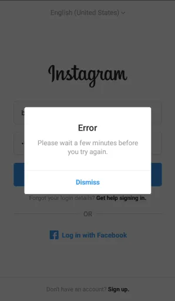

# Error Handling

## Introduction

In any web application, things don’t always go as planned – forms might have invalid input, network requests can fail, or pages may not load. **Error handling** is the practice of designing how these situations are communicated to users through error messages and error-state screens. A well-designed error message can turn a moment of frustration into an opportunity to guide the user. Rather than simply flashing a cryptic "Error occurred" dialog, effective error handling provides clear information and a path forward. In this guide, we’ll explore how to craft user-friendly, consistent error messages and flows that keep users informed and empowered even when something goes wrong.

## Why It Matters

Nobody enjoys encountering errors, but they are inevitable. How errors are handled can make or break the user experience. Poorly designed error messages – those that are vague, technical, or hard to notice – leave users frustrated or completely lost . On the other hand, helpful error handling can preserve trust and even enhance a user’s confidence in your app by showing that you’ve anticipated issues and are ready to help. As Jakob Nielsen’s usability principles note, helping users recognize and recover from errors is a key quality factor in usable design . Put simply, clear error handling prevents small hiccups from turning into full "I give up" moments. It reassures users that the app is still reliable and that _they_ haven’t done something irreversibly wrong. Good error design can thus reduce abandonment, support calls, and lost transactions by keeping users on track.

## Key Principles

When designing error messages and flows, a few fundamental principles ensure a positive experience:

*   **Clarity and Specificity:** An error message should plainly state what happened and, if possible, why. Users should immediately understand what the issue is. Vague messages like "Error 1234" or just "Something went wrong" are unhelpful. Instead, describe the problem in human-friendly terms (e.g. _"Your last name cannot include numbers"_ or _"We couldn’t save your changes because the server is not responding."_). Be specific enough that the user knows which action or data the error is referring to. According to UX best practices, clear and concise language is crucial – shorter sentences (under ~14 words) significantly increase user understanding .
    
*   **Constructive Tone:** Errors are frustrating, so the tone of your message should be calm, empathetic, and _never_ blame the user. Avoid phrasing that implies the user is at fault (no "invalid user input!" finger-pointing). Also steer clear of overly cutesy "oops" language or jokes that might come off as condescending . A straightforward "We’re sorry, _X_ didn’t work because…" maintains a professional but human tone. The goal is to acknowledge the issue without scolding or confusing the user. Use polite language and maybe a touch of reassurance (e.g. "please try again") to keep the experience positive.
    
*   **Visibility and Context:** Ensure error messages are highly visible and appear in the right context. They should be displayed close to the related interface element or action so users can’t miss them . For example, form field errors should appear near the field (with clear red highlights and messages) rather than as a generic message at the top. Use visual cues – color (red is standard for errors), icons (like a warning triangle), or subtle animations – to make the error stand out . However, don’t rely on color alone (for accessibility, include an icon or text indicator) . The user’s attention should be drawn naturally to the problem area.
    
*   **Guidance and Recovery:** Every error message should help the user move forward. This means offering a solution or next step. Tell the user what to do about the issue – whether it’s correcting an input, checking their connection, or contacting support. A good error message will _"inform the user what happened, explain why, and help them move ahead"_ . For example, _"We couldn’t process your payment because the card was declined. Please verify your card details or try a different card."_ Even if there’s no immediate fix, guide the user on how to proceed (e.g. "Please try again in a few minutes, and contact support if the issue persists"). The user should never be stuck wondering _"Now what?"_ after an error appears.
    
*   **Consistency:** Treat error messages as a part of your app’s overall voice and design system. Consistent style – in wording, tone, and visual presentation – helps users predict and understand errors more easily. Define standard patterns for errors (e.g., red text, placement below form fields, consistent terminology like "Please…" for instructions). Consistency also means handling similar errors in similar ways across the app. If one form displays errors inline but another pops up an alert, users won’t know what to expect. Establishing an error message style guide (covering phrasing, tone, and visuals) can ensure a unified experience.
    
*   **Preventive Design:** The best error message is one that never needs to appear. Wherever possible, design to _prevent_ errors or catch them early. This includes using constraints and validation (e.g., disabling a Submit button until required fields are filled, or using input masks for things like dates). Inline validation can warn users of issues in real-time before they submit a form . For instance, if a password is too short, show a hint as the user types rather than after form submission. By guiding users _before_ an error occurs, you reduce frustration and the volume of errors. However, even with preventive measures, always have those clear, friendly error states as a safety net.
    

## Best Practices

With those principles in mind, here are some concrete best practices for designing error messages and error states in web apps:

*   **Use Plain Language:** Write error text in plain language that your average user can understand. Avoid technical jargon, error codes, or system-speak. Instead of "HTTP 408 timeout," say _"Connection timed out. Please check your internet and try again."_ Keep sentences brief and clear – research shows that users comprehend short messages far better . If the error is complex, break it into a short summary and perhaps a longer explanation or tip if needed.
    
*   **State What Happened and Why:** Make sure the user knows what the error pertains to. For example, _"The username is already taken"_ clearly ties to the Username field and explains why the action failed. Whenever possible, include a brief reason: _"couldn’t upload because the file is over the size limit," "login failed because the password was incorrect,"_ etc. Providing a reason gives context and often helps the user figure out how to fix it.
    
*   **Suggest a Solution:** Always pair the error description with constructive next steps. Tell the user how to resolve the problem or alternative actions to take. For instance, _"Please choose a different username"_, _"Try reloading the page,"_ or _"Contact support if this keeps happening"_. If the solution is simply to retry, say that explicitly. The user should feel that they have a clear path forward. In short, _don’t stop at what went wrong – guide on how to make it right_.
    
*   **Place Errors Near Their Source:** Align the error message’s placement with the context of the error. Inline form errors should appear right below or beside the field in error (with the field highlighted). Page-level errors (like a failed save) might appear in a banner or modal at the top of the page, but ensure it’s visually associated with the action that triggered it. By keeping errors proximate to where the issue occurred, you reduce cognitive load on the user to connect the message with the problem .
    
*   **Make Errors Visually Clear:** Design error states so that they are hard to miss. Use a color like red that contrasts strongly with the background and with normal text . Use an icon or bold styling for the error text. If using a banner, consider a subtle animation (like a shake or fade-in) to draw attention. Ensure text is large enough to read easily, and if the error is critical (blocking further use) make it prominent (e.g., a dialog or banner that stands out). That said, for non-critical minor errors, a less intrusive inline message might suffice – it’s about matching the emphasis to the severity.
    
*   **Don’t Erase User Input:** A common frustration is when a form error causes the form to clear all the user’s inputs. Avoid this at all costs. Preserve what the user already entered so they can adjust just the erroneous part without starting over. Respect the user’s effort – if an error occurs, try to keep as much context (pre-filled fields, etc.) intact as possible. For multi-step processes, allow users to go back and correct inputs rather than forcing a full restart.
    
*   **Avoid ALL CAPS and Excess Punctuation:** Writing in all caps or adding lots of "!!!" can make it seem like you’re shouting at the user . Stick to normal sentence casing or title casing for messages. Use exclamation points sparingly – one "!" if truly needed for urgency is plenty (and even that can often be omitted if the design already conveys urgency). A calm tone, as if a helpful person is speaking, tends to be better received than an alarmist tone.
    
*   **Provide Reference Info if Helpful:** In certain cases, especially for advanced user audiences or developers (if your app is developer-facing), it might help to include a bit of technical info or an error code _in addition_ to a friendly message. If you do, make it opt-in or secondary (e.g., a collapsed "Show details" section) so that non-technical users aren’t overwhelmed. For example, a file upload error could say _"Upload failed due to a server error."_ and have a "More info" that reveals the server response or error code. This way, power users or support staff have something to go on, while regular users can ignore it.
    
*   **Test Error Scenarios:** Just as you’d test happy paths in your app, actively test and review the error states. During design, think through various error scenarios (form validation errors, server outages, 404 pages, etc.) and create designs and copy for each. In development, trigger those errors (e.g., disconnect network, input invalid data) to see what users will experience. This helps catch unhandled cases or poor messaging before users do. It’s also wise to do user testing or heuristic evaluation focusing on errors – see if people understand the messages and know how to recover.

## Examples from Real Apps

Even subtle differences in error message design can have a big impact on user understanding. Let’s look at two examples from real applications – one less helpful, and one more user-friendly:

*Instagram’s login interface once presented a generic error popup: “Error – Please wait a few minutes before you try again.” This message is short, but it’s not very informative. It doesn’t explain why the user has to wait or what went wrong. The user is left guessing whether their login was blocked, the server is down, or something else happened. There’s also no guidance on what to do if waiting doesn’t help, nor any link to get more help. A vague error like this can frustrate users because it interrupts their task without providing clarity or a clear resolution path.*

*Spotify, on the other hand, offers a much clearer example. In this screenshot, a red banner at the top of the app states: “We have a little problem. Your Premium payment failed. Please make sure we’ve got your details right.” This error message does several things right: it catches your attention with color and placement, it plainly describes the issue (payment failed), and it suggests a next step (check your payment details). The tone is polite – it says “we have a problem” (the app taking some blame) rather than “you did something wrong.” A clear call-to-action (fix your details) is implied, which helps users resolve the issue quickly. This kind of error message likely results in far less confusion – users immediately know what happened and how to fix it, which keeps them on track.*

Beyond text copy, some apps even add delightful touches to error states to soften the blow. For example, GitHub’s famous 404 page shows a whimsical illustration of an out-of-order robot, along with a message that the page isn’t found but offering a search bar to find something else. It’s a helpful error page that uses humor and design to turn a dead-end into a more positive experience. As another example, Slack might show an offline error with a friendly graphic and a reassurance like “Looks like you’re not connected to the internet” plus steps to reconnect. These real-world approaches underscore that error states can reflect your brand’s personality and usability – they need not be blank or purely negative screens.
